# 

<!-- Animated Wave Header -->
<div align="center">
  
</div>

<!-- Animated Title with Rainbow Effect -->
<div align="center">
  <a href="https://git.io/typing-svg">
    
  </a>
</div>

<!-- Animated Social Links -->
<div align="center">
  
  <a href="https://www.linkedin.com/in/ghufran-ullah-b36b411b9">
    
  </a>
  <a href="https://github.com/ghufran496">
    
  </a>
  <a href="mailto:ghufran.chaudary12@gmail.com">
    
  </a>
  
  
  <br><br>
  
  
  
  
</div>

<!-- Animated Divider -->


##  About Me 

<table align="center">
  <tr>
    <td width="50%">
      


  </td>
  <td width="50%">

```javascript
const ghufran = {
    title: "🎯 Mid-Level Software Developer",
    company: "💼 Devscomet",
    location: "📍 Islamabad, Pakistan",
    experience: "⚡ 5+ Years",
    education: "🎓 BS Software Engineering (3.73/4.0)",
    
    superpowers: {
        frontend: ["React.js", "Angular", "Next.js"],
        backend: [".NET Core", "Node.js", "Express"],
        cloud: ["Azure", "AWS", "Docker", "K8s"],
        databases: ["PostgreSQL", "MongoDB", "SQL Server"]
    },
    
    achievements: {
        projects: "50+ Delivered",
        deployment: "40% Faster",
        mentees: "3 Developers"
    },
    
    currentMission: "Building the future, one commit at a time 🚀"
};
```

  </td>
  </tr>
</table>

<!-- Animated Skills Section -->
##  Tech Stack Mastery

<div align="center">

###  Frontend Magic


###  Backend Wizardry  


###  Database & Cloud Sorcery


###  Tools & DevOps Arsenal


</div>

<!-- Animated Divider -->


## 🏆 Trophy Cabinet & Achievements

<div align="center">
  
[](https://github.com/ryo-ma/github-profile-trophy)

### 🎯 Impact Metrics

<table>
  <tr>
    <td align="center">
      
      <br><b>Freelance Excellence</b>
    </td>
    <td align="center">
      
      <br><b>DevOps Mastery</b>
    </td>
    <td align="center">
      
      <br><b>Leadership Impact</b>
    </td>
    <td align="center">
      
      <br><b>Academic Excellence</b>
    </td>
  </tr>
</table>

</div>

##  Featured Projects Showcase

<div align="center">

<!-- Project Cards with Hover Effects -->
<table>
  <tr>
    <td align="center" width="50%">
      <h3>☁️ Cloud Management Portal</h3>
      
      
      
      <br><br>
      <i>ETL Pipeline Management with Power BI Integration</i>
      <br>
      <b>🔥 2024 | Enterprise Solution</b>
    </td>
    <td align="center" width="50%">
      <h3>🌐 Unifaires Platform</h3>
      
      
      
      <br><br>
      <i>Multi-language Platform with Real-time Features</i>
      <br>
      <b>🚀 2025 | Full Stack</b>
    </td>
  </tr>
  <tr>
    <td align="center" width="50%">
      <h3>🎓 Cerifi Edutech</h3>
      
      
      
      <br><br>
      <i>Multi-tenant LMS for Financial Education</i>
      <br>
      <b>📚 2023 | EdTech Solution</b>
    </td>
    <td align="center" width="50%">
      <h3>🤖 HelloDrew AI</h3>
      
      
      
      <br><br>
      <i>AI-Powered Real Estate Assistant</i>
      <br>
      <b>🏠 Freelance | AI Innovation</b>
    </td>
  </tr>
</table>

</div>

<!-- Animated Statistics -->
## 📊 GitHub Analytics Dashboard

<div align="center">
  
</div>

<div align="center">
  
  
</div>

<div align="center">
  
</div>

<!-- Contribution Graph with Animation -->
<div align="center">
  <h2>🔥 Contribution Heatmap</h2>
  
</div>

<!-- Snake animation -->
<div align="center">
  <h2>🐍 Watch My Contributions Snake</h2>
  <picture>
    <source media="(prefers-color-scheme: dark)" srcset="https://raw.githubusercontent.com/platane/snk/output/github-contribution-grid-snake-dark.svg">
    <source media="(prefers-color-scheme: light)" srcset="https://raw.githubusercontent.com/platane/snk/output/github-contribution-grid-snake.svg">
    
  </picture>
</div>

## 🎯 Current Focus & Learning Journey

<div align="center">
  <table>
    <tr>
      <td align="center" width="33%">
        
        <br><b>🔭 Currently Working On</b><br>
        Cloud Infrastructure<br>
        Microservices Architecture<br>
        AI Integration
      </td>
      <td align="center" width="33%">
        
        <br><b>🌱 Learning</b><br>
        Kubernetes Orchestration<br>
        System Design<br>
        Web3 Technologies
      </td>
      <td align="center" width="33%">
        
        <br><b>💡 Interests</b><br>
        Open Source<br>
        Tech Mentorship<br>
        Innovation
      </td>
    </tr>
  </table>
</div>

<!-- Professional Timeline -->
## 🚀 Professional Journey Timeline

```mermaid
graph LR
    A[2020: Started BS Software Engineering] -->|Freelancing| B[2022: HUAWEI Internship]
    B --> C[2022-2023: Devscomet Intern]
    C --> D[2023: Junior Developer]
    D --> E[2023-2024: Associate Engineer]
    E --> F[2024-Present: Mid-Level Developer]
    F --> G[Future: Senior Architect]
    
    style A fill:#ff6b6b
    style B fill:#4ecdc4
    style C fill:#45b7d1
    style D fill:#96ceb4
    style E fill:#ffeaa7
    style F fill:#dfe6e9
    style G fill:#74b9ff
```

<div align="center">



</div>

## 💬 Random Dev Quote

<div align="center">
  
</div>

## 🤝 Let's Connect & Collaborate!

<div align="center">
  
  
  
  
  <br><br>
  
  <h3>💌 Reach Out to Me!</h3>
  
  📧 **Email:** ghufran.chaudary12@gmail.com  
  📱 **Phone:** +92-3497935680  
  📍 **Location:** Islamabad, Pakistan  
  💼 **Open for:** Freelance Projects | Full-time Opportunities | Collaborations
  
  <br>
  
  <a href="https://www.linkedin.com/in/ghufran-ullah-b36b411b9">
    
  </a>
  <a href="https://calendly.com/ghufran-chaudary12">
    
  </a>
  
</div>

<!-- Animated Footer -->


<div align="center">
  
  ###  Thanks for visiting! 
  
  
  
  ⭐️ **From [ghufran496](https://github.com/ghufran496) with** 
  
</div>
